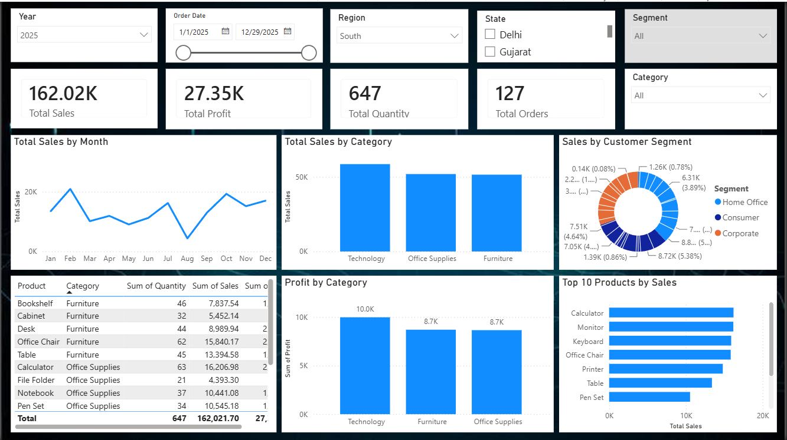

# 📊 Sales Analytics Dashboard

## 📌 Project Overview

This project is an interactive **Sales Analytics Dashboard** developed using **Microsoft Power BI**. The dashboard analyzes sales performance and provides meaningful insights into revenue, profit, quantity sold, products, regions, and monthly trends.

## 🎯 Objectives

* Analyze overall sales performance
* Track key business KPIs
* Identify top-performing products
* Analyze sales across different regions
* Understand monthly sales trends
* Identify patterns and trends to support data-driven decision-making

## 🛠️ Tools & Technologies

* Microsoft Power BI
* Microsoft Excel
* Data Cleaning
* Data Analysis
* Data Visualization
* DAX

## 📈 Key KPIs

* Total Sales
* Total Profit
* Total Quantity
* Sales by Region
* Sales by Product
* Monthly Sales
* Top 10 Products
* Customer Analysis

## 📊 Dashboard Features

* Interactive KPI cards
* Sales and profit analysis
* Regional performance analysis
* Product performance analysis
* Monthly sales trend
* Top product analysis
* Interactive filters and slicers
* Business-focused data visualizations

## 💡 Key Insights

The dashboard helps identify high-performing products and regions, understand sales trends over time, and evaluate overall business performance.

## 📷 Dashboard Preview

Add your dashboard screenshot here.

## 📂 Project Files

* `Sales_Analytics_Dashboard.pbix` — Power BI dashboard
* `Sales_Data.xlsx` — Dataset used for analysis
* `Dashboard_Screenshot.png` — Dashboard preview

## 👨‍💻 Author

**Adarsh Kate**

B.Sc. Information Technology Graduate
Interested in Data Analytics, Power BI, SQL, Excel and Python.

## 📷 Dashboard Preview

